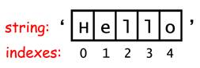

#JavaScript Data Types and String Methods


## Data Types

When you initialize (or create) a variable, you have reserved some space in memory. Based on the kind -or type - of data, the interpreter will allocate a set amount of memory for your variable.

Javascript is dynamically typed - or loosely typed - which means one variable can be reassigned to a different datatype.

JavaScript has a relatively small number of data types compared to other languages like Python. You've explored two of these data types already - numbers and strings.

1. **Number**: 1, 3.14, 0.13, -100, …  
2. **String** (as in, a string of characters). examples include: "hi!", '-Cubs-', "1999" - note you can use either single or double quotation marks
3. **Boolean**: Represents either true or false
4. **Undefined**: has not been assigned a value, so the value is unknown
5. **Null**: This is a special keyword that means one of two things: no value or empty. The difference from undefined is that when a variable is null, it is still defined

## String Methods and Properties

With numbers, you can use math operations. With strings, there are string operations called methods.

A method is a function - a set of actions - attached to a piece of data. When a method is called on a string, it modifies that string based on that set of actions.

JavaScript has a number of built in methods that we can call on strings. The syntax for calling methods is dot notation, which looks like this:
```
variable.method()
```

Notice that all methods have a set of parentheses, where you can include arguments - additional information that describes how you want the method to be performed.

### Some String Methods

Open up the JavaScript console to test what a certain method does. The following examples uses a variable, myText:

> ` myText= "Code Ninja"`

**.charAt(x)** - Returns the character at the “x” position within the string. Like many languages, Javascript starts counting at 0.
```
> myText.charAt(0)
< "C"

> myText.charAt(3)
< "e"
```
**.concat(string1, string2)** - Combines one or more strings (arguments) into the existing one.
```
> myText.concat(" duh")
< "Code Ninja duh"
```

### String Methods with Indexing
A string represents a group of characters in a certain order. To find out which character is in a certain position, we can use indexing. Indexing is similar to counting, expect in Javascript, the index starts at 0. So in the string "Google", the capital G has an index of 0. The final e has an index of 5.



**indexOf(substr, [start])** - Searches and (if found) returns the index number of the first match to the characters. If not found, -1 is returned.
```
> myText.indexOf("z")
< -1
> myText.indexOf("Ni")
< 5
```

**substr(start, [length])** - Stands for substring - a string within a string. Returns the characters in a string beginning at “start” and through the specified number of characters, “length”. If length is not included, this function returns the remaining characters.
```
> myText.substr(1,6)
< "ode Ni"
```


###Different Method Syntaxes
Sometimes, there are multiple syntaxes that do the same thing.
```
> "one ".concat("two")
"one two"
>"one " + "two"
"one two"
```
When we add strings to each other, we stick one right on the end of the other. This is called concatenation, and we can do it with the .concat() method or with the '+'.


### Assigning Variables and Stringing Methods
You can make a new variable from the result of a function call.
```
> var extraAnger = "loathe".toUpperCase()
```
You can chain functions - call a function on the result of another function:
```
>extraAnger.substr(0,2).toLowerCase().concat("ve")
```
You can combine these tricks. You can even store the resultant value in the same variable you started with!
```
> var emotion1 = "angry"
> var emotion2 = "hungry"
> emotion1 = emotion2.substr(0,1) + emotion1
```

### String Properties
You can also use dot notation to call a property on a string to find out some valuable information about it. The most common string property is the length property.
```
var emotion3 = "satiated"
> emotion3.length
> 8
```
Since length is a property rather than a method, its notation does not include parenthesis () at the end.


##Resources
[W3 Schools String Methods](http://www.w3schools.com/js/js_string_methods.asp)

[15 JavaScript String Functions](http://www.sitepoint.com/15-javascript-string-functions/)
